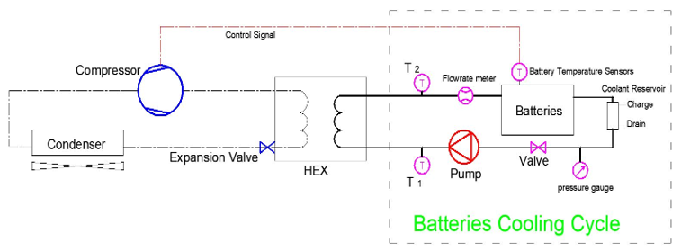
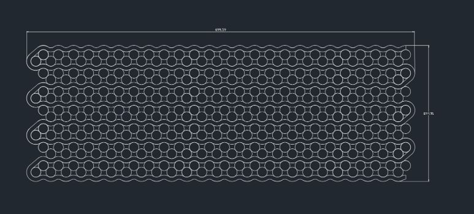
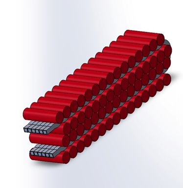
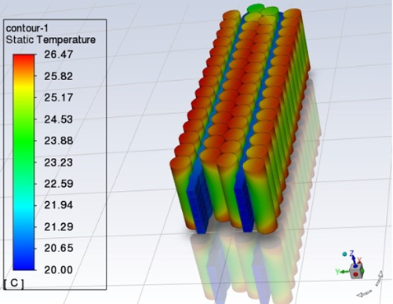
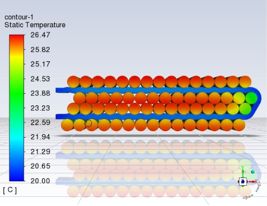
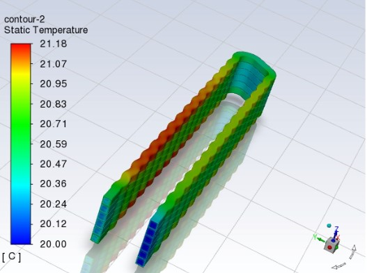
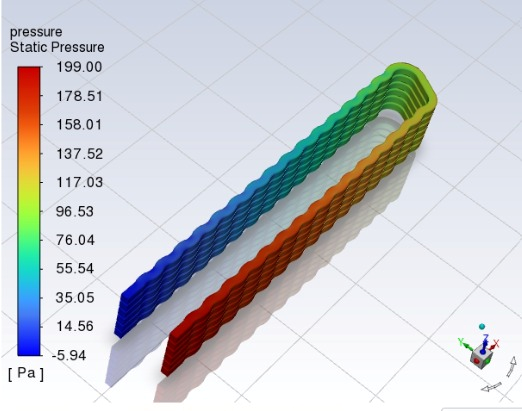

Research Work Objectives:
=====

1- choose the suitable cooling method (bottom plate cooling, micro channels, immersed cooling or corrugated cooling tubes )  
2- Design mathematical representation of the battery heating . 
3- build the computational domain in ANSYS software. 
4- optimize the bottom plate internal groves to ensure sufficient cooling and uniform battery thermal distribution.  
5- study the effect of adding multi cooling plates to the battery.  

Project Insights:
=====
{: .align-right width="350px"} 
 {: .align-right width="350px"} 

- It is a national project to have the first steps in manufacturing a locally-made Electric vehicle.
- This project is in cooperation with the (Military technical college) as well as some other engineering schools.
- This project is sponsored by (The Academy of Scientific Research & technology) and the ( Arab organization for industrialization ) with budget 11 million Egyptian pounds around 450K US $.
- The prototype of the electric vehicle is planned to get finalized by June 2023.

The Bttery Cooling System Design 
=====

The battery cooling system should manage the thermal energy from Battery pack. The refrigeration cycle receives sensing signal (on / off) controlled, from the temperature sensor hold on the batteries.
    

The designed system comprises of:
- Refrigeration cycle working with R 134a refrigerant with adjustable expansion valves.
- Heat exchangers for transfer the battery heat to the refrigeration cycle 
- Circulate pump to circulate the coolant through the batteries 
- Control valve to control the pressure drop from the battery pack.
- Coolant reservoir.
- Measuring instrument
- Temperature sensors for the circulating coolant (T1 and T2).
- Temperature sensors for battery cells.
- Pressure gauge.
- Flow rate meter

Cooling passages general arrangements
=====

- The battery bank is divided into 16 modules each with 350 (14*25) cells (18650) 
- The outer dimension of the module is 70cm * 25cm 
- The outer dimension of the battery pack is 203cm * 140cm
- The required pressure of the pump is estimated to be 270 pascal with flow rate around 5 lit/min

    

For The Simplicity Issues We Will Only Simulate One Path of the Module to Assure Alignment Between the Analytical and Simulation Result  
=====
    

The Pack Arrangement 
-----

    

Simulation Using Ansys Fluent
=====

Boundary conditions 
- Inlet 
  Number of inlet areas are 6 for the side plate 
  Mass flow is 0.05 kg/s with temperature of 20 ℃

- Outlet  
  Number of inlet areas are 6 for the side plate 
  Pressure outlet, surrounding temperature of 25 ℃
  
- Heat source 
  Battery is subjected to heat generation with the rate of 5 c-rate (57812)W/m3
  
- Walls  
  All the walls are adiabatic except for the upper wall of the battery subjected to natural conviction with heat transfer coefficient of (5 W/m2K) and surrounding temperature of 25 ℃.

Results And Discussion
=====

The Following Results Are taken When Applying (5C) rate
-----

1- Temperature Contour  

- The Whole Battery Module  
    
    

- The Cooling Passages   
    

2- Pressure Contour  
    

<!-- excerpt: "Short description of portfolio item number 1 "
