<!--
---
title: 'LYCANS Aero Design team'
date: 2012-08-14
permalink: /posts/2012/08/blog-post-1/
tags:
  - cool posts
  - category1
  - category2
---
-->

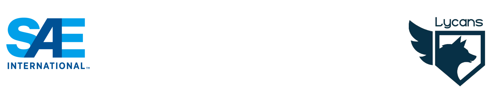{: .align-right width="800px"}  

LYCANS Aero Design team
======
Lycans team is the only Egyptian and Arabian team that participate in the Advanced Class of the SAE Aero Design Competition that is held by the SAE every year in the USA. The objective of the Advanced Class (2023) is to design and build an RC aircraft capable of delivering different types of payloads to a certain location. This is done by developing a release mechanism; to release the Powered Autonomous Delivery Aircraft (PADA) and ensure that it lands in the target drop zone as well as carry as bottles of water as possible .

The aim is to optimize the aircraft design to carry as much weight within the design rules and to release the (PADA) to land in the target points in the air field ; to obtain the highest possible score. Limitations on motor power and wing span, along with other competition restrictions make this grueling challenge a perfect playground for engineering students to utilize their knowledge and brain power in finding optimum solutions to the problems. In order to achieve our objective of developing an aircraft capable of obtaining the highest score, the team is divided into six sub-teams:
- Wing Sub team
- Tail and Stability Sub team
- Fuselage Sub team
- Propulsion Sub team
- PADA Sub team
- Electrical and AI Sub team

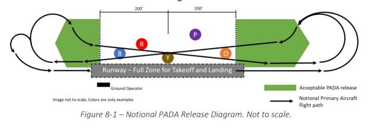{: .align-middle width="800px"}  
PADA Release zone  

LYCANS Medals and Achievements during that time
======
{: .align-middle width="800px"}  
Season 2020 .............. Season 2021 ............ Season 2022  

- 2020 6th place ( virtual events due to Covid-19)
- 2021 2nd place 
- 2022 4th place (the rules has been changes)  

My journey with LYCANS
======

Season 2019-2020 
------
My first year with LYCANS as a mechanical design and manufacturing member 
Simulate the preliminary designed wing at different angles of attack to obtain accurately the lift generated and visualize the vortexes affecting the tail
Simulate the designed wind with different Winglets to reduce the effect of the downwash on the wing.
Fabricate the wing and the tail with control surfaces 

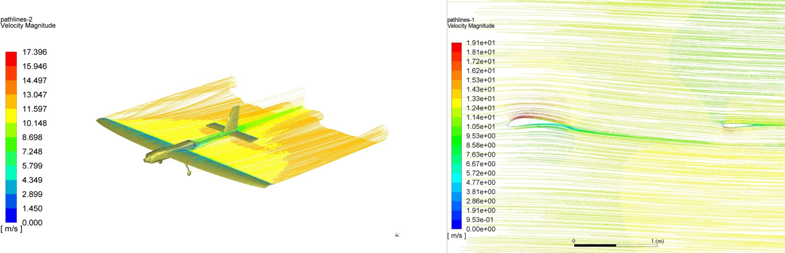{: .align-middle width="600px"} 
Perform CFD analysis over the body of the plane  
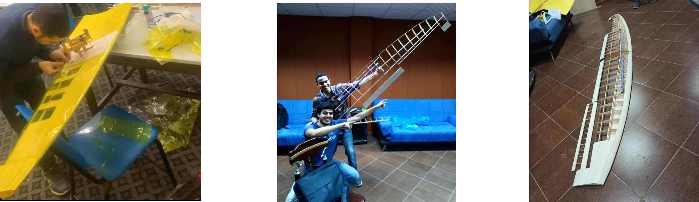{: .align-middle width="600px"}  
Some Manufacturing Snaps   
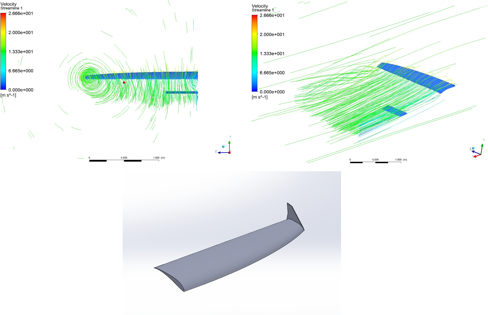{: .align-middle width="600px"} 
Check the vortexes on the wing tip    

Season 2020-2021
------
Mechanical Designer and CFD analyst mentor.
Make FEA for the Carbone fiber landing gear to ensure that the frame will withstand the impact load of a brutal landing 
Make FEA for the fuselage (plane body) to optimize the weight VS stiffness using topology optimization method.
I have made Videos to give the new comer a prompt push to Ansys and CFD world. 
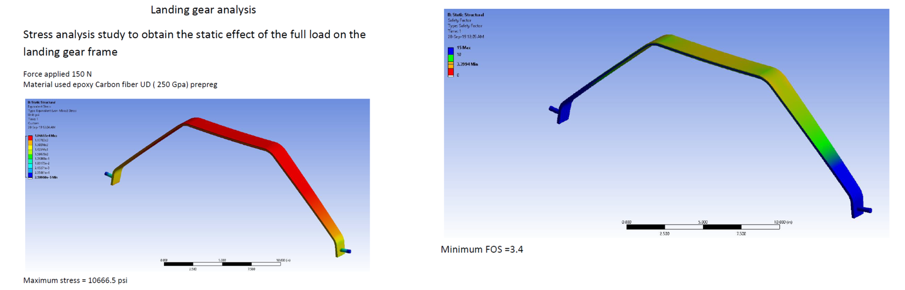{: .align-middle width="700px"}  
Check the landing gear  
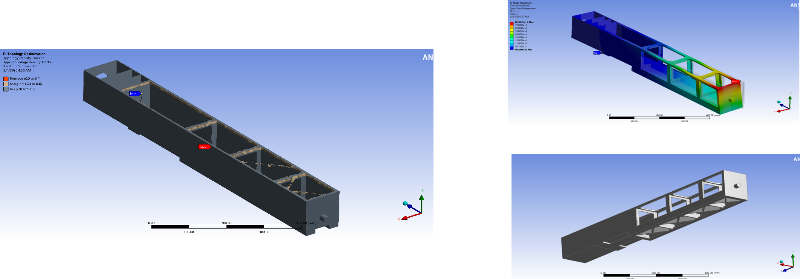{: .align-middle width="700px"}  
Optimize the fuselage  

Season 2021-2022
------
Field team captain, Mechanical designer, troubleshooter and CFD analyst mentor.
Simulate the designed wing at different angles and identify the angles at which the wing tends to stall while taking off and landing.
Design vortex generator attached to the wing to diminish the separation at high angles of attach to ensure safe landing and taking off at harsh cross wind speed conditions to fit the in Californian weather at that time, that will help the (PADA) to get released at accurate timing and positioning.
Coupling the CFD data from the wing to carry on FEA for the wing structure and the main spur and obtain the safety margins
Design a special release mechanism to unmounts the (PADA) in the air 
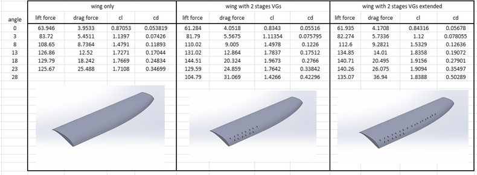{: .align-middle width="600px"}  
Study the effect of the Vortex Generators (VGs)   
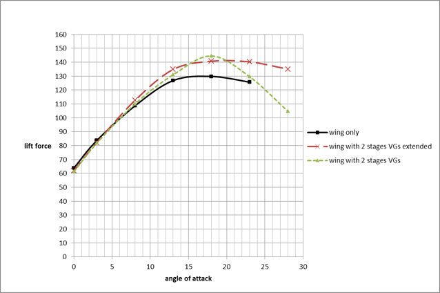{: .align-middle width="600px"}  
Plot the performace of the wing in all the cases of the Vortex Generators (VGs)   
[Watch The Plane Takes off at 24 Angle of attack!](https://www.youtube.com/watch?v=6lks7HZXlo4&t=193s)   

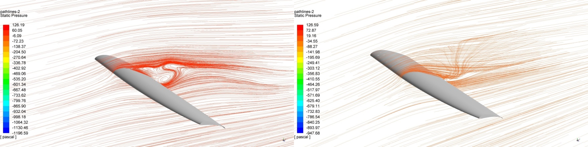{: .align-middle width="800px"}  
Study the stream lines of the air around the wing before and after the insertion of the Vortex Generators (VGs)    

{: .align-middle width="800px"}  

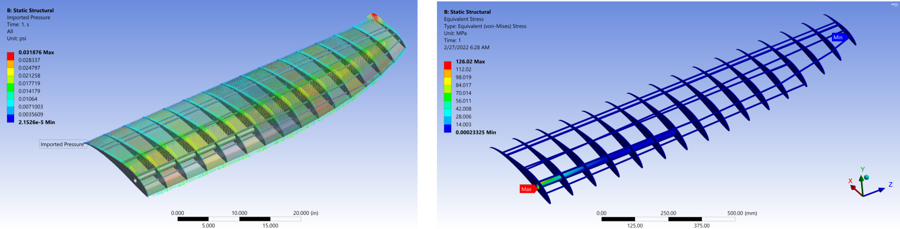{: .align-middle width="800px"}  
Study the wing structure (plot the stress contours)   

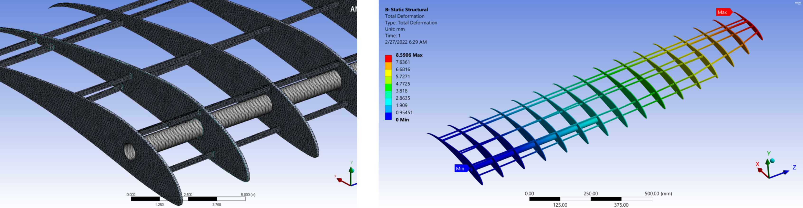{: .align-middle width="800px"}  
Study the wing structure (plot the displacement contours)   

{: .align-middle width="800px"}  
Ground Test (Season 2022)    

{: .align-middle width="700px"}  
Lycans and California teams (Season 2022)    

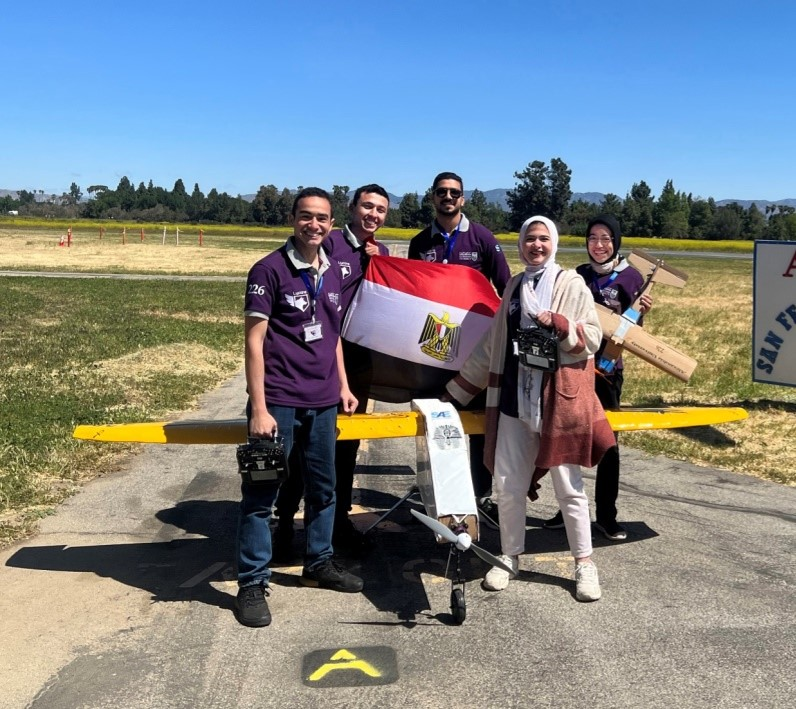{: .align-middle width="800px"} 
Lycans team (Season 2022)    

