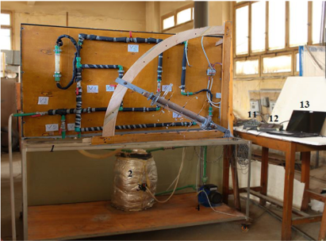

Optimization Thermal storage unit for overnight domestic water heating
=====

The usage of phase change materials (PCMs) is an effective method of storing thermal energy and to reduce fossil fuel usage. Latent heat storage systems, in this regard, have been applied for different industrial cases due to their unique characteristics: large latent heat, chemical stability, non-corrosiveness and constant temperature during phase change are some proper characteristics of these systems.  
   
The Test Section Drawing     

In the current project, a comprehensive experimental and numerical investigation is conducted to estimate the performance of a concentric tube storage unit with an inner ellipse shaped tube during melting process. 
With several inclination incidences and inner tube angles  
   
Schematic diagram of Water circulation of the test rig     

   
The Test Rig

The Research Overview
=====
Research objectives:
1- Investigate and identify major parameters that effect the thermal energy transfer from the water to the storage medium.
2- Design and optimize a thermal storage system for the domestic use capable of supplying hot water, absorbing the solar energy at daytime.
3- Select the suitable storage medium to fit the design conditions. 

Research focuses on the effects of :
- The aspect ratio of the inner elliptical tube. 
- Test section angle. 
The choice of RT42 PCM refers to its suitable phase change temperature that is well adapted to low temperature heat sources like solar systems and power plants exhaust. 

seven inclination angles at horizontal (θ = 0°), vertical orientation (θ = 90°) and in the intermediate orientation (θ =15°,30°, 45°,60° and 75°) were numerically investigated as well as the effects of several aspect ratios of the inner elliptical tube (1,0.8, 0.6,0.4).  

  
Test section study angles     
   
Sample liquid fraction contours results extracted from the research    

My roles in the research work 
=====

1- Investigate the of the nonconformity of the experimental and Numerical work, that were recommended to be a future work in the graduation project.  
2- Simulate different props arranges before executing the new configuration.  
3- Study time step independence, mesh independence and run the final computational model.  
4- Conduct the experimental trials, present the data in graph, make comparisons and comment on them.  
5- Contribute in the paper writing in the sections of: Experimental set up, experimental results and boundary conditions and validation.   

   
   

The new experimental work in the research
=====

In the previous version of the project we have used a (8 mm) copper tube installing 3 thermocouples inside it to measure the temperature in different depth locations from the outer shell, due to the large diameter (8 mm) of the prop compared to the wax gap as well as wax is very viscous substance that helped to obstruct  the convection currents and that all contributed to keep the wax solid around the prop; consequently poor temperature measuring.

   
The red circle highlights the solid wax around the thermocouple tube the surrounding wax is liquid so the temperature is higher that the melting temperature while the props keeps indicating the melting temperature.   

To solve this problem an adequate design for the props is required   
Instead of using one (8 mm ) tube, 3 (2 mm) props were inspected by Ansys to verify uniform temperature distribution across the section of the props and no wax gathering   
   

The new 3D printed model thermocouple holder  
The new 3D printed thermocouple holder  
The old thermocouple prop   

   
The new test section configuration with thermocouples, the thermocouples’ wires are insulated to ensure accurate temperature measuring.   

   
   

