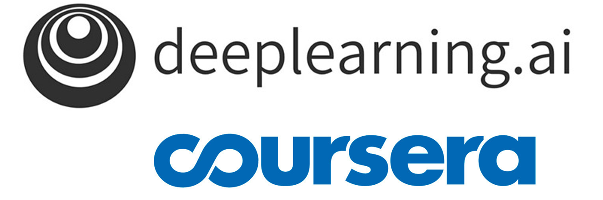

# AWS Academy Cloud Foundations Certificate
### The badge ["AWS Academy Cloud Foundations"](https://www.credly.com/badges/3b0260ee-0f8f-440b-9c8c-864dfa081a6f/linked_in_profile)
**AWS Academy Cloud Foundations** program, is a foundational course designed to provide a comprehensive understanding of cloud computing concepts and Amazon Web Services (AWS) infrastructure. This certification is ideal for individuals new to cloud computing, and it helped me build a solid base of knowledge in this rapidly growing field.

## Key Learning Areas

### 1. Introduction to Cloud Computing
I started with the basics, gaining an understanding of cloud computing concepts. I explored the benefits of cloud services and how they compare to traditional IT models.

### 2. AWS Global Infrastructure
I familiarized myself with AWS's global network of data centers. This included understanding regions, availability zones, and edge locations, which are crucial for deploying scalable and resilient applications.

### 3. Core AWS Services
I learned about key AWS services like EC2 (computing), S3 (storage), and RDS/DynamoDB (databases). I now understand how these services interact and how to use them to build scalable, reliable applications.

### 4. Security and Compliance
Security is a major focus in AWS, and I gained insights into AWS's shared responsibility model. I learned about tools like IAM (Identity and Access Management) and encryption methods to help ensure security and compliance in cloud environments.

### 5. Cost Management
Understanding the AWS pricing model and cost management strategies was another key area. I learned how to use AWS tools like Cost Explorer and budgets to manage and optimize cloud spending effectively.

### 6. Architecting on AWS
The course introduced me to best practices for designing and deploying cloud architectures. I learned about the AWS Well-Architected Framework, which helps ensure that cloud solutions are scalable, resilient, and cost-efficient.

### 7. Basic Networking
Networking in the cloud was another crucial topic. I gained an understanding of VPCs (Virtual Private Clouds), subnets, and network security groups, and how to set up and manage network configurations in AWS.

### 8. AWS Support and Pricing
Finally, I learned about the different AWS support plans and how to optimize costs. Managing accounts effectively and understanding AWS's pricing structure are essential skills I developed.

## Skills I Gained
Upon completing the AWS Academy Cloud Foundations program, I gained the following skills:

- **Cloud Computing Fundamentals**: I now have a strong understanding of cloud computing concepts and the benefits of using cloud services.
- **AWS Services**: I developed practical knowledge of core AWS services and how they can be utilized to build cloud-based solutions.
- **Security and Compliance**: I’m familiar with AWS security practices and compliance frameworks, ensuring safe and compliant cloud operations.
- **Cost Management**: I can manage and optimize cloud costs using AWS's various financial management tools.
- **Architectural Understanding**: I now have a foundational knowledge of how to design, deploy, and maintain cloud architectures that are scalable, resilient, and cost-effective.

<!--
This is a description of your talk, which is a markdown files that can be all markdown-ified like any other post. Yay markdown!
type: "Talk"
venue: "UC San Francisco, Department of Testing"
date: 2012-03-01
location: "San Francisco, California"

-->
